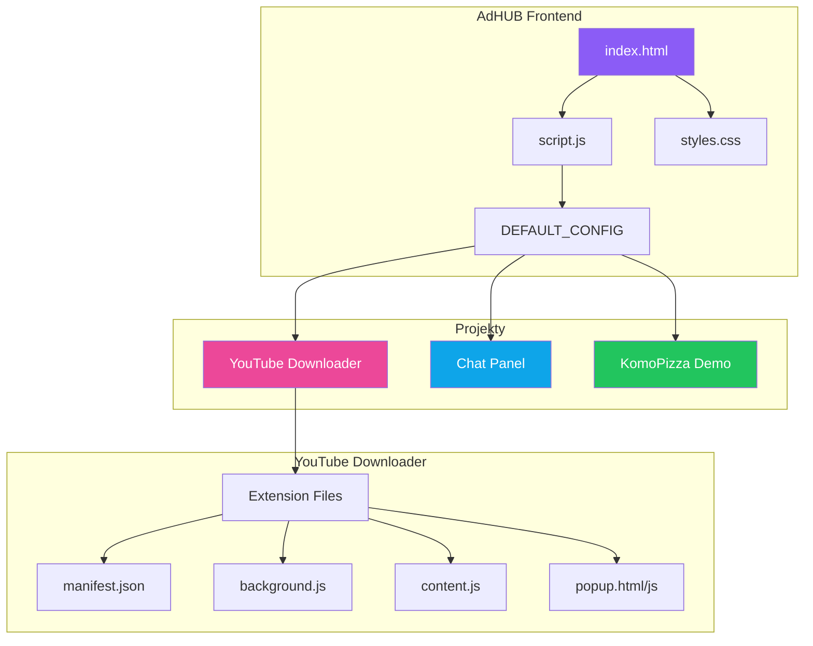
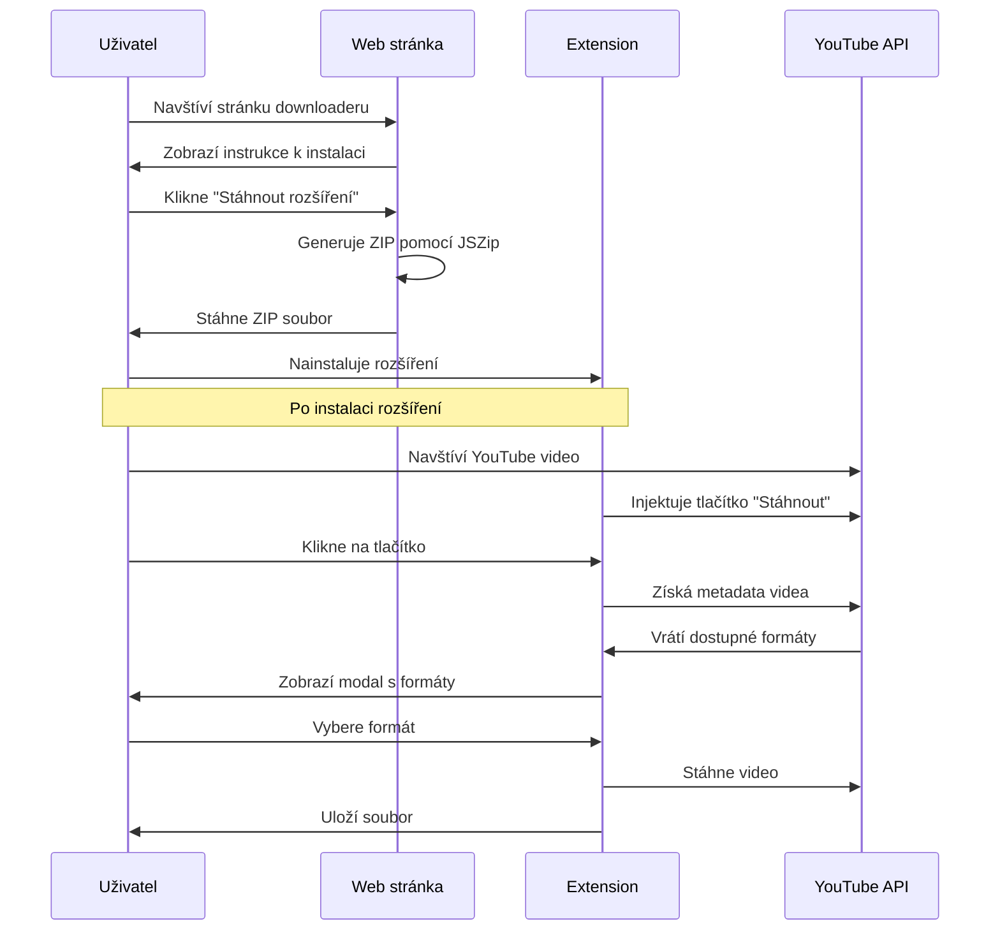

# 🎯 AdHUB - Centrální Hub pro nástroje a utility

AdHUB je centrální rozcestník pro různé nástroje, utility a projekty. Vše přístupné z jednoho místa s moderním a přehledným rozhraním.

  

## ✨ Funkce

- 🔍 **Vyhledávání** - Rychlé vyhledávání napříč všemi nástroji a odkazy
- 🏷️ **Kategorie a tagy** - Filtrování podle kategorií a tagů
- 📱 **Responzivní design** - Funguje na všech zařízeních
- 🌙 **Moderní tmavé téma** - Šetrné k očím
- ⚡ **Bez serveru** - Funguje jako statická stránka (GitHub Pages)

## 📦 Projekty

### 🎥 YouTube Downloader
Rozšíření pro Chrome/Edge/Brave umožňující stahování YouTube videí a audia přímo z prohlížeče.

**Funkce:**
- Stahování videí v různých kvalitách (360p - 4K)
- Stahování audia (M4A, WebM)
- Tlačítko přímo na YouTube stránce
- Bez potřeby externího serveru

### 💬 Multistream Chat Panel
Unified chat pro streamery - zobrazuje chat z Twitch, Kick a YouTube na jednom místě.

**Funkce:**
- Podpora více platforem
- Overlay mód pro OBS
- Customizovatelný vzhled

### 🍕 KomoPizza Demo
Ukázková objednávková aplikace demonstrující moderní UI/UX principy.

---

## 🗺️ Architektura



### Struktura projektu

```
adhub/
├── index.html              # Hlavní stránka AdHUB
├── script.js               # Logika a konfigurace nástrojů
├── styles.css              # Styly (pokud existují)
├── README.md               # Tento soubor
├── projects/
│   ├── youtube-downloader/
│   │   ├── index.html      # Stránka ke stažení rozšíření
│   │   ├── script.js       # Generátor ZIP + logika
│   │   ├── styles.css      # Styly
│   │   └── extension/      # Soubory rozšíření
│   │       ├── manifest.json
│   │       ├── background.js
│   │       ├── content.js
│   │       ├── popup.html
│   │       ├── popup.js
│   │       └── icons/
│   ├── chat-panel/
│   │   ├── index.html
│   │   ├── script.js
│   │   ├── styles.css
│   │   └── server/         # Server pro live chat API
│   └── komopizza/
│       ├── index.html
│       ├── script.js
│       └── styles.css
└── server/                 # (Legacy) AdHUB server
```

---

## 📋 TODO

### 🔴 Vysoká priorita
- [ ] Přidat možnost přepínání světlého/tmavého motivu
- [ ] Implementovat offline caching (Service Worker)
- [ ] Vylepšit mobilní navigaci

### 🟡 Střední priorita
- [ ] Přidat statistiky stahování pro YouTube Downloader
- [ ] Implementovat uživatelské nastavení (localStorage)
- [ ] Přidat podporu pro více jazyků (i18n)
- [ ] Vytvořit dokumentaci pro přidávání nových projektů
- [ ] Implementovat klávesové zkratky

### 🟢 Nízká priorita
- [ ] Přidat animace při přechodu mezi stránkami
- [ ] Vytvořit PWA verzi
- [ ] Přidat možnost exportu/importu konfigurace
- [ ] Implementovat drag & drop řazení nástrojů

### ✅ Dokončeno
- [x] Základní struktura AdHUB
- [x] YouTube Downloader rozšíření
- [x] Chat Panel pro streamery
- [x] Responzivní design
- [x] Vyhledávání a filtrování
- [x] Aktualizace na statické stránky (bez nutnosti serveru)

---

## 🔄 Flow diagram - YouTube Downloader



---

## 🛠️ Instalace a spuštění

### Varianta 1: GitHub Pages (doporučeno)
1. Forkněte tento repozitář
2. Aktivujte GitHub Pages v nastavení
3. Přistupte na `https://vasusername.github.io/adhub`

### Varianta 2: Lokální spuštění
```bash
# Klonování repozitáře
git clone https://github.com/Deerpfy/adhub.git
cd adhub

# Otevření v prohlížeči
# Stačí otevřít index.html v prohlížeči
# Nebo použít lokální server:
npx serve .
# nebo
python -m http.server 8000
```

---

## 🎨 Technologie

- **Frontend:** Vanilla JavaScript, HTML5, CSS3
- **Extension:** Chrome Manifest V3
- **Build:** Žádný build proces - vše je vanilla JS
- **Icons:** SVG + Canvas generované ikony
- **ZIP:** JSZip library pro generování rozšíření

---

## 📝 Přidání nového projektu

1. Vytvořte složku v `projects/nazev-projektu/`
2. Přidejte `index.html` jako vstupní bod
3. Upravte `script.js` a přidejte do `DEFAULT_CONFIG.tools`:

```javascript
{
    "id": "muj-projekt",
    "name": "Můj Projekt",
    "description": "Popis projektu",
    "category": "kategorie",
    "icon": "🔧",
    "url": "projects/muj-projekt/index.html",
    "type": "local",
    "enabled": true,
    "tags": ["tag1", "tag2"]
}
```

---

## 🤝 Přispívání

1. Forkněte repozitář
2. Vytvořte feature branch (`git checkout -b feature/nova-funkce`)
3. Commitněte změny (`git commit -m 'Přidána nová funkce'`)
4. Pushněte branch (`git push origin feature/nova-funkce`)
5. Otevřete Pull Request

---

## 📄 Licence

Tento projekt je licencován pod MIT licencí - viz soubor [LICENSE](LICENSE) pro detaily.

---

## 👤 Autor

**Deerpfy**

- GitHub: [@Deerpfy](https://github.com/Deerpfy)

---

## ⭐ Podpora

Pokud se vám projekt líbí, dejte mu hvězdičku! ⭐

```
   ___       __  ____  ______  ____
  / _ | ____/ / / / / / / _ )/ __/
 / __ |/ _  / _  / /_/ / _  |\ \  
/_/ |_|\_,_/_//_/\____/____/___/  
                                   
```
