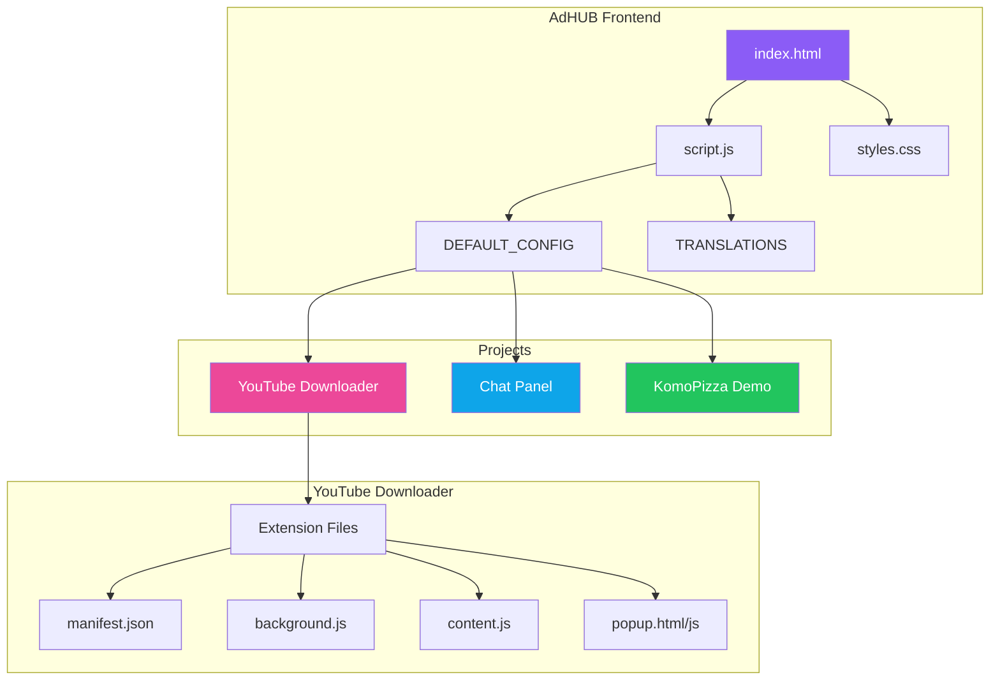

# 🎯 AdHUB - Central Hub for Tools and Utilities

AdHUB is a central hub for various tools, utilities and projects. Everything accessible from one place with a modern and clear interface.

  

## ✨ Features

- 🔍 **Search** - Quick search across all tools and links
- 🏷️ **Categories and tags** - Filtering by categories and tags
- 📱 **Responsive design** - Works on all devices
- 🌙 **Modern dark theme** - Easy on the eyes
- ⚡ **No server needed** - Works as a static page (GitHub Pages)
- 🌐 **Multi-language support** - Czech and English with automatic language detection
- 🔢 **Versioning** - Version display in header and footer

## 📦 Projects

### 🎥 YouTube Downloader
Browser extension for Chrome/Edge/Brave enabling download of YouTube videos and audio directly from your browser.

**Features:**
- Download videos in various qualities (360p - 4K)
- Download audio (M4A, WebM)
- Button directly on YouTube page
- No external server required

### 💬 Multistream Chat Panel
Unified chat for streamers - displays chat from Twitch, Kick and YouTube in one place.

**Features:**
- Multi-platform support
- Overlay mode for OBS
- Customizable appearance

### 🍕 KomoPizza Demo
Sample ordering application demonstrating modern UI/UX principles.

---

## 🗺️ Architecture



### Project Structure

```
adhub/
├── index.html              # Main AdHUB page
├── script.js               # Logic, configuration and translations
├── styles.css              # Styles
├── README.md               # This file
├── projects/
│   ├── youtube-downloader/
│   │   ├── index.html      # Extension download page
│   │   ├── script.js       # ZIP generator + logic
│   │   ├── styles.css      # Styles
│   │   └── extension/      # Extension files
│   │       ├── manifest.json
│   │       ├── background.js
│   │       ├── content.js
│   │       ├── popup.html
│   │       ├── popup.js
│   │       └── icons/
│   ├── chat-panel/
│   │   ├── index.html
│   │   ├── script.js
│   │   ├── styles.css
│   │   └── server/         # Server for live chat API
│   └── komopizza/
│       ├── index.html
│       ├── script.js
│       └── styles.css
└── server/                 # (Legacy) AdHUB server
```

---

## 📋 TODO

### 🔴 High Priority
- [ ] Add light/dark theme toggle
- [ ] Implement offline caching (Service Worker)
- [ ] Improve mobile navigation

### 🟡 Medium Priority
- [ ] Add download statistics for YouTube Downloader
- [ ] Implement user settings (localStorage)
- [ ] Create documentation for adding new projects
- [ ] Implement keyboard shortcuts

### 🟢 Low Priority
- [ ] Add page transition animations
- [ ] Create PWA version
- [ ] Add configuration export/import option
- [ ] Implement drag & drop tool ordering

### ✅ Completed
- [x] Basic AdHUB structure
- [x] YouTube Downloader extension
- [x] Chat Panel for streamers
- [x] Responsive design
- [x] Search and filtering
- [x] Update to static pages (no server required)
- [x] Multi-language support (Czech/English)
- [x] Version display

---

## 🔄 Flow Diagram - YouTube Downloader


---

## 🛠️ Installation and Running

### Option 1: GitHub Pages (recommended)
1. Fork this repository
2. Enable GitHub Pages in settings
3. Access at `https://yourusername.github.io/adhub`

### Option 2: Local Running
```bash
# Clone repository
git clone https://github.com/Deerpfy/adhub.git
cd adhub

# Open in browser
# Just open index.html in browser
# Or use a local server:
npx serve .
# or
python -m http.server 8000
```

---

## 🌐 Language Support

AdHUB supports multiple languages with automatic detection:

- **Czech (CZ)** - Full Czech translation
- **English (EN)** - Full English translation

The language is automatically detected from your browser settings, or you can manually switch using the language selector in the header. Your preference is saved to localStorage.

### Adding New Languages

To add a new language, edit `script.js` and add translations to the `TRANSLATIONS` object:

```javascript
const TRANSLATIONS = {
    // ... existing languages
    de: {
        search_placeholder: 'Suche...',
        filter_all: 'Alle',
        // ... add all translation keys
    }
};
```

---

## 🔢 Versioning

AdHUB uses semantic versioning (MAJOR.MINOR.PATCH):

- **MAJOR** - Incompatible API changes
- **MINOR** - New functionality (backward compatible)
- **PATCH** - Bug fixes

Current version: **1.0.0**

Version is displayed in:
- Header badge (next to logo)
- Footer

To update version, modify `APP_VERSION` in `script.js`:

```javascript
const APP_VERSION = '1.0.0';
```

---

## 🎨 Technologies

- **Frontend:** Vanilla JavaScript, HTML5, CSS3
- **Extension:** Chrome Manifest V3
- **Build:** No build process - everything is vanilla JS
- **Icons:** SVG + Canvas generated icons
- **ZIP:** JSZip library for extension generation
- **i18n:** Built-in translation system

---

## 📝 Adding a New Project

1. Create folder in `projects/project-name/`
2. Add `index.html` as entry point
3. Edit `script.js` and add to `getLocalizedConfig()`:

```javascript
{
    "id": "my-project",
    "name": t('tool_myproject_name'),
    "description": t('tool_myproject_desc'),
    "category": "category",
    "icon": "🔧",
    "url": "projects/my-project/index.html",
    "type": "local",
    "enabled": true,
    "tags": ["tag1", "tag2"]
}
```

4. Add translations to `TRANSLATIONS` object for both `cs` and `en`.

---

## 🤝 Contributing

1. Fork the repository
2. Create a feature branch (`git checkout -b feature/new-feature`)
3. Commit changes (`git commit -m 'Add new feature'`)
4. Push branch (`git push origin feature/new-feature`)
5. Open Pull Request

---

## 📄 License

This project is licensed under the MIT License - see the [LICENSE](LICENSE) file for details.

---

## 👤 Author

**Deerpfy**

- GitHub: [@Deerpfy](https://github.com/Deerpfy)

---

## ⭐ Support

If you like this project, give it a star! ⭐

```
   ___       __  ____  ______  ____
  / _ | ____/ / / / / / / _ )/ __/
 / __ |/ _  / _  / /_/ / _  |\ \  
/_/ |_|\_,_/_//_/\____/____/___/  
                                   
```
